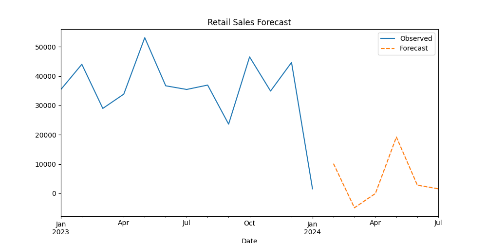

<h1 align="center">📈 Retail Sales Forecasting with SARIMA</h1>

  Predict future retail sales using Time Series techniques like ARIMA and SARIMA. 
  Built in Python, visualized with Seaborn & Matplotlib, and evaluated using MAPE.

---

## 🔍 Problem Statement

Retail businesses often struggle with inventory planning due to uncertain future demand.  
This project uses **Time Series Forecasting** to help retailers:

- 📦 Reduce overstock and understock  
- 📊 Optimize supply chain planning  
- 📈 Make data-driven decisions  

---

## 📦 Dataset Overview

- **Source**: Simulated retail transaction data  
- **Period Covered**: Jan 2023 – Jan 2024  
- **Columns**:
  - `Transaction ID`
  - `Date`
  - `Product Category`
  - `Quantity`
  - `Price per Unit`
  - `Total Amount`

---

## ⚙️ Tech Stack

- **Python 3.10+**
- **Jupyter Notebook**
- **Libraries**:
  - `pandas`, `numpy`
  - `matplotlib`, `seaborn`
  - `statsmodels`, `sklearn`

---

## 🧠 Methodology

1. 📅 **Data Aggregation** – Monthly total sales  
2. 📊 **EDA** – Explore seasonal trends by category & time  
3. ⚙️ **Decomposition** – Trend, seasonal & residual separation  
4. ✅ **ADF Test** – Check for stationarity  
5. 🔁 **SARIMA Modeling** – Train time series model  
6. 🔮 **Forecasting** – Predict next 6 months  
7. 🧪 **Evaluation** – MAPE (Mean Absolute Percentage Error)

---

## 📈 Forecast Output

---

## 📁 Project Structure

Retail-Sales-Forecasting/
├── retail_sales_dataset.csv              # Source retail sales data
├── Retail_Sales_Forecasting.ipynb        # Main notebook with SARIMA modeling
├── requirements.txt                      # Python dependencies
├── README.md                             # Project documentation
└── output/                               # Output visualizations
    └── forecast_plot.png                 # Sales forecast graph
    
---

## 🚀 How to Run

# Clone the repository
git clone https://github.com/parvsirohi/retail-sales-forecasting-sarima.git
cd retail-sales-forecasting-sarima

# Install requirements
pip install -r requirements.txt

# Launch Jupyter Notebook
jupyter notebook Retail_Sales_Forecasting.ipynb

---

📊 MAPE Score
The SARIMA model achieved a MAPE of ~72.20%.
With more historic data, this accuracy can be significantly improved.

---

👨‍💻 Author
Made by Parv Sirohi
🔗 LinkedIn Profile
📫 parvsirohi218@gmail.com
